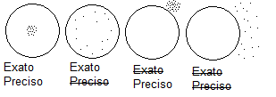

```{r setup, include=FALSE}
knitr::opts_chunk$set(echo = TRUE)
```

<style>
  body{
    text-align: justify;
    font-size: 16px
    }
  h4 {font-size:20px}
  h5 {font-size:18px}
  strong {fontsize:16px}
</style>

Esse documento busca resumir as matérias do curso de estatística e ser um material de revisão e consulta dessas.
<br>

# **1° Ano**
<p>O primeiro ano é uma base para os próximos anos, sendo constituído de várias matérias de matemática pura e outras de estatística básica, essas matérias serão utilizadas em todos os anos seguintes. Essas matérias sendo, no primeiro semestre, Calculo I, Geometria Analítica, Estatística I e Fundamentos de Probabilidade, já no segundo, Calculo II, Algoritmos, Estatística II e Probabilidade I.</p>
<br>

##  **Cálculo I**

---

<p>Cálculo I é uma matéria fundamental para desenvolvimento do curso, apresentando três novas funções matemáticas, o limite, a derivada e a integração. Essas funções serão utilizadas em todas as matérias tanto de cálculo como de estatística.</p>

### **Limite**

#### **O que é um limite?**
Primeiramente, precisamos entender o que é o limite de uma função.

$$\lim\limits_{x \to 5} f(x) = 4$$

<p>Esse limite seria interpretado como a função f(x) se aproxima de 4 quando x tende a 5. Ou seja, quanto mais o valor de x da função se aproximar de 5, mais o resultado dessa função vai se aproximar de 5. Ou seja, o limite de uma função é o valor que ela se aproxima quando o valor do x se aproxima de outro valor. Assim, o limite de f(x) quando x tende à 5 é 4</p>

<p>Existem outras formas de se aproximar de um número na linha Real, tando pela esquerda, aumentando os número, como 0, 1, 2..., quanto pela direita, diminuindo os números, como 8, 7, 6..., esses são chamados de limites laterais, tendo uma notação para cada na tendência do x. </p> 

$$\lim\limits_{x \to 5^-} f(x) = 4$$
Quando a função se aproxima pela esquerda.

$$\lim\limits_{x \to 5^+} f(x) = 4$$
Quando a função se aproxima pela direita.

<p> Uma função pode ou não ter um limite, se ambos limites laterais forem iguais, ela tem um limete, se não, não existe limite daquela função.</p><br>

#### **Regras operacionais de limite**

$$\lim\limits_{x \to a} f(x) + g(x) = \lim\limits_{x \to a} f(x) + \lim\limits_{x \to a} g(x)$$
Ou seja, o limite da soma de funções de mesma base, é a soma dos limites das funções.

$$\lim\limits_{x \to a} K*f(x) = K*\lim\limits_{x \to a} f(x)$$
Ou seja, o limite de uma constante vezes uma função é o pruto da constante pelo limite

$$\lim\limits_{x \to a} f(x) * g(x) = \lim\limits_{x \to a} f(x) *\lim\limits_{x \to a} g(x)$$
Ou seja, o limite do produto de funções, é o produto dos limites das funções.

$$\lim\limits_{x \to a} \frac{f(x)}{g(x) }= \frac{\lim\limits_{x \to a} f(x)}{ \lim\limits_{x \to a} g(x)}$$
Ou seja, o limite da divisão de funções, é a divisão dos limites das funções.

$$\lim\limits_{x \to a} f(x) ^n= (\lim\limits_{x \to a} f(x))^n$$
Ou seja, o limite de uma função elevada a uma potência, é a potência do limite.
<br>

#### **Calculando Limites**

O limite pode ser calculado via substituição direta, que significa trocar a variável x pelo valor que ela tende, por exemplo:

$$\lim\limits_{x \to 5} x^2 - 1$$

$$5^2 - 1$$

$$25 - 1$$

$$\lim\limits_{x \to 5} x^2 - 1 = 24$$

No entanto, muitas vezes não podemos substituir diretamente como quando o resultado do limite retorna uma indeterminação, por exemplo

$$\lim\limits_{x \to -1} \frac{x^2 -1}{x + 1}$$

$$\frac{-1^2 -1}{-1 + 1}$$

$$\frac{1-1}{-1+1}$$

$$\frac{0}{0}$$
Esse resultado é chamado indeterminação, não podendo ser considerado, para resolver essa indeterminação podemos seguir dois caminhos, o primeiro mexendo na equação e o segundo aplicando L'Hospital.
<br>
**Resolvendo indeterminações**

Olhando a equação anterior podemos separar a equação da parte de cima, o dividendo, é um produto da diferença.
$$\lim\limits_{x \to -1} \frac{x^2 -1}{x + 1}$$
$$\lim\limits_{x \to -1} \frac{(x+1)(x-1)}{x + 1}$$
$$\lim\limits_{x \to -1} (x-1)$$
Agora podemos fazer via substituição direta.

$$(-1 -1)$$
$$\lim\limits_{x \to -1} \frac{x^2 -1}{x + 1} = -2$$

Podemos resolver a inderteminação via L'hospital, que basicamente é derivar a parte de cima da divisão e parte de baixo, independetemente, derivação será explicada mais pra frente.
*OBS: L'Hospital apenas resolver equações que a indeterminação é do tipo $\frac{0}{0}$ e $\frac{\infty}{\infty}$.*

$$\lim\limits_{x \to -1} \frac{(x^2 -1)'}{(x + 1)'}$$
$$\lim\limits_{x \to -1} \frac{(2x)}{(1)}$$
Agora podemos fazer via substituição direta

$$(2*(-1))$$
$$\lim\limits_{x \to -1} \frac{x^2 -1}{x + 1} = -2$$
<br>

####  **Alguns limites fundamentais**

Limites fundamentais são alguns limites que valem um valor conhecido, e são utilizados para descobrir outros limites mais complexos


$$\lim\limits_{x \to 0} \frac{sen(x)}{x} = 1$$
$$\lim\limits_{x \to 0} \frac{1 - cos(x)}{x} = 1$$
$$\lim\limits_{x \to 0^+} \frac{1}{x^r} = +\infty$$
$$\lim\limits_{x \to 0^-} \frac{1}{x^r} =$$ 
Se r é ímpar $-\infty$, se r é par $+\infty$

$$\lim\limits_{x \to -\infty} \frac{1}{x^r} = 0$$ 
$$\lim\limits_{x \to +\infty} \frac{1}{x^r} = 0$$ 
<br>
### **Derivação**

#### **O que é uma derivada?**
A derivada representa o coeficiente de varição da reta tangente da função no ponto, sendo a inclinação dessa reta. Esse processo tem duas principais notações, sendo elas $f'(x)$ e $\frac{d}{dx}f(x)$.
<br>

#### **Regras de derivação**

A derivação de funções mais complexas são resolvidas com base em algumas derivações já conhecidas, essas já conhecidas sendo chamadas de regras de derivação.

**Regra da constante**<br>
A derivada de uma função constante é zero.
Ex:
$$\frac{d}{dx}(5) = 0$$
**Regra da potência**<br>
Conhecida também como regra do tombamento, quando temos uma potência de x descemos a potência como produto e elevamos x potência menos um.
Ex:
$$\frac{d}{dx}(x^5) = 5 \cdot x^{5-1}$$
$$\frac{d}{dx}(x^5) = 5 \cdot x^{4}$$
**Regra da soma**<br>
A derivada de uma soma de funções é a soma das derivadas das funções.
Ex:
$$\frac{d}{dx}(x^3 + 4x) = \frac{d}{dx}(x^3) + \frac{d}{dx}(4x)$$
$$\frac{d}{dx}(x^3 + 4x) = 3x^2 + 4)$$

**Regra do produto**<br>
A derivada de um produto de funções é a soma da derivada da primeira vezes a segunda com a derivada da segunda vezes a primeira.<br>
No caso geral: $(f(x) \cdot g(x))' = f'(x)\cdot g(x) + g'(x)\cdot f(x)$<br>
Ex:
$$(x \cdot (2 - x^2))' = x'\cdot (2 - x^2) + (2 - x^2)'\cdot x$$
$$(x \cdot (2 - x^2))' = 1\cdot (2 - x^2) + (-2x)\cdot x$$
$$(x \cdot (2 - x^2))' = 2 - x^2 -2x^2$$
$$(x \cdot (2 - x^2))' = 2 -3x^2$$

**Regra da Divisão**<br>

A derivada de uma divisão de funções é a diferença da derivada da primeira vezes a segunda com a derivada da segunda vezes a primeira, tudo isso dividido pela segunda ao quadrado.<br>
No caso geral: $\left(\frac{f(x)}{g(x)}\right)' = \frac{f'(x)\cdot g(x) - g'(x)\cdot f(x)}{g(x)^2}$<br>
Ex:
$$\left(\frac{x}{2 - x^2}\right)' = \frac{x'\cdot (2 - x^2) - (2 - x^2)'\cdot x}{(2-x^2)^2}$$
$$\left(\frac{x}{2 - x^2}\right)' = \frac{1\cdot (2 - x^2) - (-2x)\cdot x}{(2-x^2)^2}$$
$$\left(\frac{x}{2 - x^2}\right)' = \frac{1\cdot (2 - x^2) - (-2x)\cdot x}{(2-x^2)^2}$$
$$\left(\frac{x}{2 - x^2}\right)' = \frac{2 - x^2 -2x^2}{(2-x^2)^2}$$
$$\left(\frac{x}{2 - x^2}\right)' = \frac{2 - x^2 -2x^2}{(2-x^2)^2}$$
$$\left(\frac{x}{2 - x^2}\right)' = \frac{2 - 3x^2}{(2-x^2)^2}$$
Essa regra pode ser usada para resolver divisões de derivada, no entanto elas podem ser resolvidas também via regra do produto, lembrando que uma divisão também é um produto<br>
$$\left(\frac{2x- 1}{x}\right)' = [(2x - 1)(x^{-1})]'$$
$$\left(\frac{2x- 1}{x}\right)' = (2x - 1)'\cdot x^{-1} + (x^{-1})'\cdot (2x - 1) $$
$$\left(\frac{2x- 1}{x}\right)' = 2\cdot x^{-1} + (-1\cdot x^{-2})\cdot (2x - 1) $$
$$\left(\frac{2x- 1}{x}\right)' = \frac{2}x - \frac{2x - 1}{x^2} $$
**Regra da cadeia**<br>
A regra da cadeia é usada quando temos uma composta de funções, ela é o produto da derivada da primeira aplicada na segunda com a derivada da segunda.

No caso geral: $(f \circ g)'(x) = f'(g(x))\cdot g'(x) $<br>
Ex:
$$\frac{d}{dx}(x^2 + 3x)^4$$
Nesse exemplo, $f(x) = x^4$ e $g(x) = x^2 + 3x$
Agora é necessário achar f'(g(x)) e g'(x)
$$f'(x) = 4x^3$$
$$f'(g(x))= 4(x^2 + 3x)^3$$
$$g'(x) = 2x + 3$$

$$\frac{d}{dx}(x^2 + 3x)^4 = 4(x^2 + 3x)^3 \cdot (2x + 3)$$
**Derivada da exponencial**<br>
A derivada da exponencial é a derivada do que ela está aplicada multiplicada pela expressão inicial.


**Derivada do seno**<br>
A derivada do seno é a derivada do que seno está aplicado multiplicada pelo cosseno.
<br>
Ex:
$$\frac{d}{dx}e^{2x} = \frac{d}{dx}(2x)\cdot e^{2x}$$
$$\frac{d}{dx}e^{2x} = 2e^{2x}$$
No caso mais comum, a derivada da exponencial de x é exponencial de x, pela derivada de x ser 1.
$$\frac{d}{dx}e^x = e^x$$
**Derivada do cosseno**<br>
A derivada do cosseno é a derivada do que cosseno está aplicado multiplicada por menos seno.
<br>
Ex:
$$\frac{d}{dx}cos(x^2) = \frac{d}{dx}(x^2)\cdot -sen(x^2)$$
$$\frac{d}{dx}cos(x^2) = -2x\cdot sen(x^2)$$
No caso mais comum, a derivada de cossena de x é menos seno de x, pela derivada de x ser 1.
$$\frac{d}{dx}cos(x) = -sen(x)$$


**Regra de L'Hospital**<br>
L'Hospital é usado para resolver indeterminações em limites, facilitando a resolução de indeterminações do tipo $\frac{0}{0}$ e $\frac{+\infty}{+\infty}$. Nessa regra, fazemos a derivada do dividendo e do divisor independentemente, então reaplicamos o limite.
<br>
Ex:
$$\lim\limits_{x \to +\infty} \frac{e^x}{x} $$
Substituindo apenas obteriamos $\frac{e^{+\infty}}{+\infty} = \frac{+\infty}{+\infty}$
<br> Aplicando L'Hospital
$$\lim\limits_{x \to +\infty} \frac{(e^x)'}{(x)'} = \lim\limits_{x \to +\infty} \frac{e^x}{1}$$
Agora Substituindo:

$$\lim\limits_{x \to +\infty} \frac{(e^x)'}{(x)'} = e^{+\infty} = +\infty$$

##### Maximos e mínimos
Uma aplicação de derivadas é para obter máximos e mínimos de funções.

**Pontos críticos**<br>
Todos máximos e mínimos são pontos críticos, mas nem todos pontos crítios são máximos e mínimos, pontos críticos podem ser encontrados substituindo um valor na derivada da função e resultado dá zero ou não existe.

$$f(x) = x^{\frac{4}3} + 4x^{\frac{1}3}$$
$$f'(x) = \frac{4}{3}x^{\frac{1}3} + \frac{4}{3}x^{\frac{-2}{3}}$$
$$f'(x) = \frac{4}{3}\left(x^\frac{1}{3} + \frac{1}{x^\frac{1}3}\right) = \frac{4}{3}x^{\frac{-2}{3}}(x + 1)$$
Se aplicamos em 0 a função não vai existir
$$f'(0) = \frac{4}{3}\left(0^\frac{1}{3} + \frac{1}{0^\frac{2}3}\right)$$
Sendo assim um ponto crítico.
<br> Se aplicarmos em -1
$$f'(-1) = \frac{4}{3}-1^{\frac{-2}{3}}(-1 + 1) = 0$$
Sendo outro ponto crítico<br>

**Regra da derivada primeira**
Os pontos em que a derivada troca de sinal são pontos extremos.

**Regra da derivada segunda**
É usada para determinar se é um ponto de máximo ou mínimo local


### Integração
A integral representa a área, sendo a antiderivada, ou o contrário da derivada.


## Geometria Analítica 

---

## Estatística I

---

<br><br><br>

##  **Fundamentos de probabilidade**

---

### Distribuições Discretas<br><br>
**Distribuição Uniforme Discreta**<br>
Uma das distribuições mais simples, na qual todos pontos tem mesma probabilidade.<br>

 $X$ &nbsp;~&nbsp; $U_{d}(x)$
$$f(x) = p = \frac{1}{n}$$
$\bar{x} = \frac{1}{n}\sum{x}$; &emsp;   $Var(x) = \frac{1}{n}\sum{x^2 - \frac{(\sum{x})^2}{n}}$<br><br><br>
p : A probabilidade de evento acontecer<br>
n : O número de elementos <br><br><br>

**Distribuição Bernoulli**<br>
Nessa distribuição, só há dois resultados possíveis fracasso (0) sucesso (1), e apenas é realizado uma única tentativa de experimento.<br>

$X$ ~ $Ber(p)$<br>
$$f(x) = p^x(1-p)^{1-x}$$
$\bar{x} = p$; &emsp; $Var(x) = p(1-p)$<br>
p : A probabilidade de evento acontecer <br><br><br>

**Distribuição Binomial**<br>
A distribuição binomial é a ocorrência de mais de um experimento de Bernoulli, mantendo x igual a 1 ou 0.<br>
  $X$ &nbsp;~&nbsp; $Binom(n,p)$<br>

$$f(x) = \binom nkp^x(1-p)^{(n-x)}$$
$\bar{x} = n.p$; &emsp; $Var(x) = np(1-p)$<br>
p : A probabilidade de evento acontecer<br>
n : O número de ensaios<br><br><br>

**Distribuição de Poisson**<br>
Nessa distribuição X é uma contagem do número de sucessos em um intervalo.<br>
$X$ ~ $Poisson(\lambda)$<br>

$$f(x) =  \frac{e^{-\lambda}\lambda^x}{x!}$$
$\bar{x} = Var(x) = \lambda$<br>
$\lambda$ : O valor médio de ocorrências.<br><br><br>

**Distribuição Multinomial**<br>
É uma distribuição usada para k eventos mutuamente  exclusivos, com n repetições independetes, tendo uma $p_{i}$ para cada $x_{i}$.<br>
$X$ &nbsp;~&nbsp; $M(x_{1},x_{2},...,x_{k};p_{1},p_{2},...,p_{k})$<br>

$$p(x_{1},x_{2},..,x_{k}) = \frac{n!}{x_{1}!x_{2}!...x_{k}!}p_{1}^{x_{1}}p_{2}^{x_{2}}...p_{k}^{x_{k}}$$
$\bar{x_{i}} = np_{i}$; &emsp; $Var(x_{i}) = np_{i}(1-p_{i})$<br>
$p_{i}$ : A probabilidade do evento $x_{i}$ ocorrer.<br><br><br>

**Distribuição Geométrica**<br>
É uma distribuição usada para encontrar o primeiro sucesso na i-ésima tentativa.<br>
$X$~$G(p)$<br>

$$f(x) = p(1-p)^{x-1}$$
$\bar{x}=\frac{1}{p}$; &emsp; $Var(x)=\frac{1-p}{p^2}$ <br>
p : A probabilidade do evento ocorrer<br><br><br>

**Distribuição Binomial Negativa ou de Pascal**<br>
Nessa distribuição $X$ é o número de experimentos até o r-ésimo sucesso.<br>
$X$&nbsp;~&nbsp;$BN(p,r)$<br>

$$f(x) = \binom{x-1}{r-1}p^r(1-p)^{x-r}$$
$\bar{x} = \frac{r}{p}$; &emsp; $Var(x) = \frac{r(1-p)}{p^2}$<br>
p : A probabilidade do evento ocorrer<br>
r : número de sucessos<br><br><br>

**Distribuição Hipergeométrica**<br>
É usada quando queremos a probabilidade de k sucessos em n retiradas, sem reposição, de uma população de tamanho N que contém x sucessos.<br>

$X$~$H(N,k,n)$<br>
$$f(x) = \frac{\binom k x \binom{N-k}{n-x}}{\binom N n}$$
$\bar{x} = n\frac{k}N = \frac n p$; &emsp; $Var(x)= n \frac k N \left(1-\frac k N \right) \left( \frac{N - n}{N - 1} \right)$<br>
N : Tamanho inicial da população<br>
n : Tamanho selecionado da amostra<br> 
k : Sucessos retirados na amostra<br>
x : Número de sucessos na população<br><br><br><br>

## Calculo II

---

## Algoritmos

---

<br><br><br>

## **Estatística II**

---

### Conceitos iniciais <br><br>

Sendo x uma v.a.c <br><br>

$f(x) \ge 0$ e $\int^{+\infty}_{-\infty}f(x) = 1$ <br><br>

- f é chamada de função densidade de probabilidades (fdp) de x
- FDA: $F(x) = P(X \leq x) = \int^x_{-\infty}f(t)dt$
- $E(x) = \int^{+\infty}_{-\infty}xf(x)dx$
- $Var(x) = E(x^2) - [E(x)]^2$ <br><br>

**Propriedades da média**<br>

- $E(x) = x$
- $E(kx)=kE(x)$
- $E(x \pm y) = E(x) \pm E(y)$
- $E(ax + b) = E(ax) + E(b) = aE(x) + b$ <br><br>

**Propriedades da variância**<br>

- $Var(a) = 0$
- $Var(ax) = a^2Var(x)$
- $Var(x \pm y)=Var(x) + Var(y)$
- $Var(ax + b) = Var(ax) + Var(b) = a^2Var(x)$ <br><br>

### Amostra Aleatória simples

- Todos indivíduos tem a mesma chance de ser selecionado;
- Pode ter ou não reposição, normalmente é sem;
- População é homogênea finita. <br><br>

### Teorema Central do Limite

Se $x_1,...,x_n$ for uma amostra aleatória simples de tamanho n, de média $\mu$ e var finita $\sigma^2$, então a distribuição amostral da média $\bar{x}$ será
<center>$\bar{x}$&nbsp;~&nbsp;$N \left ( \mu, \frac{\sigma^2}{n} \right )$</center>

Representa a distribuição amostral da média. <br><br>

### Estimadores

<p></p><br>
**Propriedades**<br>

- Não tendencioso (ou não viciado)<br>
&emsp; $E(\hat\theta) = \theta$<br><br>
- Tendencioso (Viciado)<br>
&emsp; Vicio: $B(\hat\theta)=E(\hat\theta)-\theta$<br><br>
- Eficiência 
&emsp;$Var(\hat\theta_1)<Var(\hat\theta_2)$ (menor melhor)

OBS: Se $\hat\theta_1$ é não viciado e tiver variância mínima, dizemos que $\hat\theta$ é ENVVM (Estimador não viciado de Var mínima)<br><br>

### Método de Máxima Verossimilhança

1. $L(\theta) = \prod^n_{i=1} f(x_1,...,x_n|\theta)$ - (Função de Verossimilhança)

2. $l(\theta)=ln(L(\theta))$

3. $\frac{\partial l(\theta)}{\partial\theta}$

4. $\frac{\partial l(\theta)}{\partial\theta}=0$

5. Verificar se $\hat\theta$ encontrado em (4) é ponto de máximo, isso derivando novamente e vendo se é menor que zero.<br><br>

### Estimação intervalar

O que precisamos "saber" para construir um Intervalo de Confiança (IC)?

- amostra
- $1 - \alpha$ (nivel de confiança)
- Distribuição amostral de $\theta$ (ou quantidade pivotal) <br><br>

O intervalo de confiança é constituído de dois intervalos, a área de rejeição e área de aceitação.

- Área de aceitação: É o intervalo em que a hipótese nula é aceita, ficando, frequentemente, em torno da média.
- Área de rejeição: É o intervalo em que a hipótese nula é rejeitada, sendo o intervalo ao entorno do de aceitação.

```{r funcao grafico IC, echo = F}
grafico.teste.norm <- function(alternative = c('greater', 'less', 'two.sided'), z_calc=NULL, conf.level = 0.95)
{
  # Criando os limites baseado no tipo do teste
  if(alternative == 'less')
    {
      lim_inf <- -4
      lim_sup <- qnorm(conf.level)
  }
  
  if(alternative == 'greater')
  {
    lim_inf <- qnorm(1 - conf.level)
    lim_sup <- 4
  }
  
  if(alternative == 'two.sided')
  {
    lim_inf <- qnorm((1 - conf.level)/2)
    lim_sup <- qnorm(conf.level + (1 - conf.level)/2)
  }
  
  # Criando o eixo x
  x <- seq(-4, 4, length=100)
  
  # criando n probabilidades, baseadas no eixo x
  y <- dnorm(x)
  
  data_fill <- data.frame(x = x, y = y)
  data_fill <- data_fill[data_fill$x < lim_sup,]
  data_fill <- data_fill[data_fill$x > lim_inf,]
  
  plot(x,y, type = "l", lwd = 2, axes = FALSE, xlab = "", ylab = "")
  axis(1, at = -3:3, labels = c(seq(-3, 3)))
  polygon(x = c(min(data_fill$x),data_fill$x , max(data_fill$x)),
          y = c(-0.0171, data_fill$y, -0.0171),
          col = "gray", border = T) 
  if (!is.null(z_calc))
  {abline(v = z_calc, lwd = 2, col = 'red', lty = 'dashed')
  text(z_calc, 0, paste0('Zc=',z_calc), col='black', cex = 0.8)}
}

grafico.teste.norm('two.sided', conf.level = 0.80)
```
<p>Esse seria um exemplo do gráfico do intervalo de confiança para uma normal, a área cinza a área de aceitação em torno da média que possui área $1 - \alpha$, e área branca a área de rejeição, possuindo área $\alpha$.</p>

Os intervalos podem ser representados das seguintes formas

$$P\left( \bar{x} - Z_{\frac{\alpha}{2}}\cdot \frac{\sigma}{\sqrt n}\leq \mu \leq \bar{x} + Z_{\frac \alpha 2} \cdot \frac{\sigma}{\sqrt n} \right) = 1 - \alpha$$
<center> **Ou** </center>

$$IC(\mu, 1 - \alpha) = \bar{x} \pm Z_{\frac{\alpha}{2}}\cdot \frac{\sigma}{\sqrt n}$$
<br><br>

#### Intervalo de confiança para $\mu$ quando $\sigma$ for desconhecido

**a) Amostras grandes**

- $X$ &nbsp;~&nbsp; $N(\mu,\sigma^2)$
- $\bar{X}$ &nbsp;~&nbsp; $N(\mu,\frac{\sigma^2}{n})$
- $IC(\mu, 1 - \alpha)$ = $\bar{x} \pm Z_{\frac{\alpha}{2}}\cdot \frac{S}{\sqrt n}$<br><br>

**b)Amostra pequena**

- $IC(\mu, 1 - \alpha)$ = $\bar{x} \pm t_{\left (\frac{\alpha}{2},n-1 \right )}\cdot \frac{S}{\sqrt n}$<br><br>

Em que t é a distribuição t student com n-1 graus de liberdade<br><br>

$$f(x) = \frac {\Gamma \left ( \frac{k + 1}{2} \right )}{\sqrt{\pi k} \Gamma{ \left ( \frac{k} {2} \right )}} \frac{1}{\left ( \frac{x^2}{k} + 1 \right ) \frac{k +1}2}$$<br><br>

#### Intervalo de confiança para a proporção populacional

- $p$ <- proporção populacional
- $\hat p$ <- proporção amostral
- $\hat p$ &nbsp;~&nbsp; $N\left (p, \frac{p(1-p)}n \right )$

Para esse intervalo de confiança há duas formas de constuílo, a otimista e a conservadora:<br><br>

$IC(p, 1-\alpha) = \hat p \pm Z_{\frac{\alpha}{2}} \cdot \sqrt{\frac{\hat p (1 - \hat p)} n}$ (otimista)

$IC(p, 1-\alpha)=\hat p \pm Z_{\frac{\alpha}{2}} \cdot \sqrt{\frac 1 {4n}}$ (conservador)<br><br>

**Margem de Erro**<br>

- $e = Z_{\frac{\alpha}{2}} \sqrt{\frac{\hat{p}(1- \hat p)}{n}}$ (Otimista)
- $e = Z_{\frac{\alpha}{2}}\sqrt{\frac{1}{4n}}$<br><br>

**Tamanho da amostra**<br>

- $n = \frac{Z_{\frac{\alpha}{2}}^2 \hat p  (1- \hat p)}{e^2}$ (Otimista)
- $n = \left (Z_{\frac{\alpha}{2}} \frac{1}{2e}\right )^2$
- $n = \left ( Z_{\frac{\alpha}{2}} \frac \sigma e \right )^2$
- $n = \left (  t_{\left ( \frac{\alpha}{2},n-1 \right )} \cdot \frac S e \right )^2$<br><br>

#### Erros associados a testes de hipóteses

```{r Erros testes hipoteses, echo= F}
erros_t12 <- data.frame('Decisão' = c('Rejeita H0', 'Não Rejeita H0'), 'H0 verdadeira' = c('Erro Tipo I', 'Sem erro'), 'H0 Falsa' = c('Sem erro', 'erro tipo II'))

head(erros_t12)
```
<br><br>
Para que serve um teste de hipóteses?

&emsp; Auxiliar na tomada de decisão com base em valores amostrais

O que é um teste de hipótese?

&emsp; Uma metodologia usada para chegar na tomada de decisão
<br><br>

- Procedimento:
1. Especificar as hipóteses nulas e alternativas<br>
2. Estabelecer a estatística teste e sua distribuição<br>
3. Estabelecer o nível de significância e regiçoes críticas<br>
4. Calcular a estatística teste<br>
5. Tomar a decisão<br><br>

Exemplo hipótese:<br>
$H_0: \theta = \theta_0$<br>
$H_1: \theta \neq \theta_0$

Sempre $H_0$ sempre carrega o igual sendo $=,\ge,\le$.<br><br>

#### Teste de hipótese proporção<br><br>

$Zc = \frac{\hat p - p}{\sqrt{\frac{p(1-p)}{n}}}$ &nbsp;~&nbsp; $N(0,1)$<br><br>

#### Cálculo do valor p:

Como o p-valor funciona?<br><br>

Basicamente se o p-valor for menor que a significância rejeita-se $H_0$ 

(Pode ser aplicado a $t_c$, $\chi^2_c$, $F_c$, etc)<br>
- Se $H_1: \theta \neq \theta_0$ => $p = 2(1- \Phi(z_c))$ <br>
- Se $H_1: \theta > \theta_0$ => $p = 1- \Phi(z_c)$ <br>
- Se $H_1: \theta < \theta_0$ => $p = \Phi(z_c)$ <br><br><br>

#### Poder do teste e tamanho da amostra

**Se bilateral**

$$n = \left ( \frac{Z_{\frac{\alpha}{2}} \sqrt{\hat p(1- \hat p)} + Z_\beta \sqrt{p(1-p)}}{p - \hat p} \right )^2$$

**Se unilateral**

$$n = \left ( \frac{Z_{\alpha} \sqrt{\hat p(1- \hat p)} + Z_\beta \sqrt{p(1-p)}}{p - \hat p} \right )^2$$<br><br><br>

#### Teste de hipótese para $\mu$

**1) Se $\sigma$ for conhecido, então**

- ##### $z_c = \frac{\bar{x} - \mu}{\frac{\sigma}{\sqrt{n}}}$ &nbsp;~&nbsp; $N(0,1)$

**2) Se $\sigma$ for desconhecido e a amostra pequena, então**

- ##### $t_c = \frac{\bar{x} - \mu}{\frac{S}{\sqrt{n}}}$  &nbsp;~&nbsp; $t_{n-1}$

**2) Se $\sigma$ for desconhecido e a amostra grande, então**

- ##### $z_c = \frac{\bar{x} - \mu}{\frac{S}{\sqrt{n}}}$ &nbsp;~&nbsp; $N(0,1)$
<br><br>

#### Distribuição Qui-quadrado <br><br>

$x$ &nbsp;~&nbsp; $\chi^2_k$

$$f(x;k)= \frac{1}{\Gamma \left(\frac{k}2 \right )2^{\frac{k}{2}}}x^{\frac{k}2 -1}e^{\frac{-x}2} $$
<br>

```{r qui-quadrado, echo= FALSE}

set.seed(1)

hist(rchisq(100000, 4),
     main = 'Distribuição Qui-quadrado com k=4',
     xlab= 'x',
     ylab = 'Probabilidade', 
     breaks = 30,
     freq = F,
     ylim = c(0,0.25),
     xlim = c(0, 20),
     col = 'gray25'
     )

```

#### Teste de hipóstese para $\sigma^2$ <br><br>

Se $Z_i$ &nbsp;~&nbsp; $N(0,1)$ <br><br>

<center> $\sum^n_{i=1}(z_i-\bar{z})^2$ &nbsp;~&nbsp; $\chi^2_{n-1}$ </center><br>

<center> e assim </center><br>

<center> $\chi^2_c = \frac{(n-1)S^2}{\sigma^2}$ &nbsp;~&nbsp; $\chi^2_{n-1}$ </center> <br><br><br>

#### Teste de hipótese para variância populacional (Fischer)

<center> $F_c = \frac{s_1^2}{s_2^2}$ &nbsp;~&nbsp; $F_{n_1 -1, n_2 - 1}$ </center>
<br><br>

- Depende de duas amostras, e $s_i$ é a variância de cada amostra
- $s_1^2$ sendo sempre maior que $s_2^2$
- É um teste para verificar se duas variâncias populacionais são diferentes baseado nas amostrais
- Por padrão o raio da diferença é 4, mas pode ser ajustado dependendo da situação <br><br>

Se $F_c \ge4$, então $\sigma^2_1 \neq \sigma^2_2$

Se $F_c <4$, então $\sigma^2_1 =\sigma^2_2$ <br><br>

#### Teste de hipóteses para $\mu_1 - \mu_2$ (Diferença de médias)

1. Se $\sigma_1$ e $\sigma_2$ são conhecidos, então

&emsp;$z_c = \frac{\bar{x_1}-\bar{x_2}}{\sqrt{\frac{\sigma_1^2}{n_1} + \frac{\sigma_2^2}{n_2}}}$ &nbsp;~&nbsp; $N(0,1)$<br><br>

2. Se $\sigma_1$ e $\sigma_2$ são desconhecidos e iguais, então

&emsp;$t_c = \frac{\bar{x_1}-\bar{x_2}}{s_p\sqrt{\frac{1}{n_1} + \frac{1}{n_2}}}$ &nbsp;~&nbsp; $t_{(n1 + n2 -2)}$

em que

&emsp;$s_p = \sqrt{\frac{(n_1-1)s_1^2 +(n_2 - 1)s_2^2}{n_1 + n_2 - 2}}$<br><br>

3. Se $\sigma_1$ e $\sigma_2$ são desconhecidos e diferentes, então

&emsp;$t_c = \frac{\bar{x_1}-\bar{x_2}}{\sqrt{\frac{s_1^2}{n_1} + \frac{s_2^2}{n_2}}}$ &nbsp;~&nbsp; $t_{\phi}$

em que

&emsp;$\phi = \frac{(\omega_1 + \omega_2)^2}{\frac{\omega_1^2}{n1-1} + \frac{\omega_2^2}{n2-1}}$;&emsp;
$\omega_1 = \frac{s^2_1}{n_1}$ &emsp;e&emsp; $\omega_2 = \frac{s^2_2}{n_2}$<br><br><br>

#### Teste t para dados pareados

$t_c = \frac{\bar{d}}{\frac{s_d}{\sqrt{n}}}$

em que,

&emsp; $d$ = Depois - Antes

&emsp; $\bar{d}$ é a média das diferenças

&emsp; $s_d$ é o desvio padrão das diferenças <br><br>

Ex: Verificar se houve mudanças na pressão arterial cistólica após o uso de determinbado farmaco.

|Antes| 139 | 116 | 136 | 133 | 132 | 131 | 124 | 135 | 133 | 144 |121|115|
|-----|-----|-----|-----|-----|-----|-----|-----|-----|-----|-----|-----|-----|
|Depois| 141 | 113 | 134 | 136 | 133 | 133 | 128 | 134 | 137 | 148|128|118|
<br>
<br>
Diferenças = {2,-3,-2,3,1,2,4,-1,4,4,7,3}
<br><br>
$\bar{d} = 2$

$S_d = 2.860$

$n = 12$

$\alpha = 0.05$

$H_0: \mu_D - \mu_A = 0$

$H_1: \mu_D - \mu_A \neq 0$

$t_c = \frac{\bar{d}}{\frac{s_d}{\sqrt{n}}} = \frac{2}{\frac{2.860}{\sqrt{12}}}=2.422$

```{r teste hipotese t pareado,echo = F}

grafico.teste.norm('two.sided', 2.422,)

```
<p>Assim, com 0.95 de confiança, a estatística $t_c$ é igual 2.422, estando na região de rejeição, portanto rejeita-se $H_0$, apresentando evidências que há diferenças de pressão antes e depois da aplicação do fármaco.</p><br>

#### Teste Qui-Quadrado

- Utilizado para avaliar a associção existente entre variáveis qualitativas

- É utilizado para verificar se variáveis estão associadas, se amostras diferentes em uma série de experimentos semelhantes são homogêneos e testar a adequalidade de um modelo probabilístico a um conjunto de dados.

$\chi = \sum\frac{(\theta - e)^2} e$ &nbsp;~&nbsp; $\chi^2_m$
<br><br>
em que
<br><br>
$m = (r-1)(s-1)$<br><br>

$\theta$: é a frequência obeservada 

$e$: é a frequência esperada <br><br>

Como calcular o esperado?

$e$ = $\frac{marginal(x)\cdot marginal(y)}{total(n)}$<br><br>

Como tomar a decisão?

$\chi^2_c \ge \chi_t^2$ $\rightarrow$ Rejeitar $H_0$

$\chi^2_c < \chi_t^2$ $\rightarrow$ Não rejeitar $H_0$<br><br>

**Pressupostos**

- Os grupos devem ser independentes e devem ser selecionados aleatoriamente

- As observações devem ser frequências ou contagens

- Cada observação pertence a uma e somente uma categoria

- A amostra deve ser relativamente grande<br><br>

Ex: Estamos interessados em estudar se a queixa de dores (presentes ou ausente) em idosos está associada a participação em um programa de atividade física. Para isso selecionou-se uma amostra de 150 idosos e foi construido a seguinte tabela de contingência:


| Queixas | Participou | Não participou | Total |
|---------|------------|----------------|-------|
| Presente| 55         | 21             | 76    |
| Ausente | 42         | 32             | 74    |
| Total   | 97         | 53             | 150   |

$H_0:$ A queixa de dores e o programa são independentes

$H_1:$ A queixa de dores e o programa não são independentes

$\alpha = 0.05$<br><br>

esperado1 = $\frac{76 \cdot97}{150} = 49.1466 \approx 49.15$

esperado2 = $\frac{76 \cdot53}{150} = 49.3333 \approx 26.85$

esperado3 = $\frac{74 \cdot97}{150} = 49.1466 \approx 47.85$

esperado4 = $\frac{74 \cdot53}{150} = 49.1466 \approx 26.15$

$\chi^2_c = \frac{(55 - 49.15)^2}{49.15} + \frac{(42 - 47.85)^2}{47.85} + \frac{(21 - 26.85)^2}{26.85} + \frac{(32 - 26.15)^2}{26.15}$

$\chi^2_c  = 3.9945$

$\chi^2_t = \chi^2_{(r -1)(s-1); 0.05} = \chi^2_{(2 -1)(2-1); 0.05} = \chi^2_{1; 0.05} = 3.841$<br><br>

Como $\chi^2_c>\chi_t^2$, então rejeitamos $H_0$, ou seja, com 95% de confiança, existem indícios de que dores e o programa não são independentes.<br><br><br>

#### Regressão linear simples

1. Correlação

2. Modelo de regressão

3. Diagnóstico

4. Extrapolação <br><br>

**Correlação**

**Coeficiente de correlação linear de Pearson**

$$\rho = \frac{cov(x,y)}{s(x)s(y)}$$

$$\rho = \frac{n\sum x_i y_i - \sum x_i \sum y_i}{\sqrt{n \sum_i  x_i^2 - (\sum_i x_i)^2} \cdot \sqrt{n \sum_i y_i^2 - (\sum_i y_i)^2}}$$

OBS: $-1 \le \rho \le 1$<br><br>

##### Teste de significância para $\rho$

$H_0:$ $\rho = 0$

$H_1:$ $\rho \neq 0$

$t_c = r \sqrt{\frac{n-2}{1-r^2}}$ &nbsp;~&nbsp; $t_{n-2}$<br><br>

Conclusão:

$|t_c| \le |t_t| \rightarrow$ não rejeita $H_0$

$|t_c| > |t_t| \rightarrow$ rejeita $H_0$<br><br><br>

##### Modelo de regressão

Esse modelo por ser linear segue a função

$\hat{a} = \bar{y} - \hat{b}\bar{x}$

$\hat{b} = \frac{n\sum x_i y_i - \sum x_i \sum y_i}{n \sum x_i^2 - (\sum x_i)^2}$<br><br><br>

##### Resíduos

$r_i = y_i - \hat{y_i}$

$\hat{\sigma^2} = \frac{S_{aE}}{n-2}$

em que

$S_{aE} = \sum_i(y_i - \hat{y_i})^2$<br><br><br>

##### Inferência sobre os parâmetros do modelo

a) Para o coeficiente angular ($\hat{b}$)

&emsp;$E_p(\hat{b}) = \sqrt{\frac{\sigma^2}{S_{xx}}}$

&emsp;$\hat{b} \pm \sqrt{\frac{\sigma^2}{S_{xx}}}t_{(n-2); \frac \alpha 2}$

&emsp;$t_c = \frac{\hat{b} - b}{\sqrt{\frac{\hat{\sigma^2}}{S_{xx}}}}$ &nbsp;~&nbsp; $t_{n-2}$

&emsp;$H_0: \hat b = 0$

&emsp;$H_1: \hat b \neq 0$

&emsp;Se |$t_c$| > $t_{\frac{\alpha}{2}; n-2} \rightarrow$ rejeita $H_0$
<br><br>

b) Para o intercepto ($a$)

&emsp;$EP(\hat{a}) = \sqrt{\hat \sigma^2 \left (\frac{1}{n} + \frac{\bar{x}^2}{S_{xx}} \right)}$

&emsp;$\hat{a} \pm \sqrt{\hat \sigma^2 \left (\frac{1}{n} + \frac{\bar{x}^2}{S_{xx}} \right )} t_{\frac \alpha 2 ; n-2}$

&emsp;$H_0: a = a_0$

&emsp;$H_1: a \neq a_0$

&emsp;$t_c = \frac{\hat a - a}{\sqrt{\hat \sigma^2 \left (\frac{1}{n} + \frac{\bar{x}^2}{ S_{xx}}\right )}}$

Se $|t_c| > t_{\frac \alpha 2 ; n-2}$ Rejeita-se $H_0$<br><br>

## Probabilidade I

---

### Distribuições Contínuas<br><br>

#### **Conceitos Gerais**<br><br>

#### **Função de Distribuição de Probabilidades - FDP**

Uma f(x) é uma função densidade de probabilidade (fdp) da variável x e possui um suporte no qual a probabilidade é maior que 0.

$$P(a \leq x \leq b) = \int_{a}^{b}f(x)dx$$

Propriedades:

- $f(x) \geq 0, \forall x \in I\!R$ 
- $\int_{-\infty}^{+\infty}f(x)dx=1$
- $P(x=0)=\int_{a}^{a}f(x)dx=0, a \in I\!R$
- $P(a\leq x\leq b) = P(a\leq x< b) = P(a<x\leq b) = P(a<x<b)$
- É a derivada da fda.


&emsp;Toda função que satisfaça as duas primeiras propridades é uma fdp.<br><br>

#### **Função de Distribuição Acumulada - FDA**

A Função de Distribuição Acumulada (fda) é a probabilidade do evento estar em um intervalo, sendo a integral da fdp.

$$F(x)=P(x \leq X) = \int_{-\infty}^{x}f(t)dt, \forall x \in I\!R$$

- $F(x)$ é não decrescente;
- $F(-\infty) = 0$ e $F(+\infty)=1$
- $F(x)$ é contínua a direita<br><br><br>


#### **Distribuição Normal**<br><br>
$Z$&nbsp;~&nbsp;$N(\mu,\sigma)$
$$f(x) = \frac{1}{\sigma\sqrt{2\pi}}e^{-\frac{1}{2}\frac{(x-\mu)^2}{\sigma^2}}$$
$$F(x) = \int\frac{1}{\sigma\sqrt{2\pi}}e^{-\frac{1}{2}\frac{(x-\mu)^2}{\sigma^2}}dx$$
Escopo:<br>
$-\infty < x < +\infty$, $-\infty < \mu < +\infty$, $\sigma > 0$<br><br>

**Propriedades**<br>

- $E(x) = \mu$
- $f(x) \ge 0, \forall x$
- A curva é simétrica em relação a $\mu$
- É assintótica em relação ao eixo x.
- O ponto de máximo é $\left ( \mu, \frac{1}{\sigma \sqrt{2 \pi}} \right )$

```{r Normal, echo = FALSE}
set.seed(1)

hist(rnorm(100000),
     main = 'Distribuição Normal',
     xlab= 'x',
     ylab = 'Probabilidade', 
     freq = F,
     ylim = c(0,0.45),
     col = 'gray25'
     )


```
<p>**Padronizando a normal**</p>
Relembrando que uma Normal padrão é $Z$~$N(0,1)$, então se $Z$~$N(\mu,\sigma)$:<br>

$$Z = \frac{x - \mu}{\sigma}$$
<center>**e**</center> 
$$f(z)=\int^z_{-\infty}\frac{1}{\sqrt{2\pi}}e^{-\frac{z^2}2}$$<br><br><br>

#### **Distribuição Exponencial**<br>
$X$~$exp(\theta)$
$$f(x) = \theta e^{-\theta x}$$
$$F(x) = 1 - e^{-\theta x}$$
Escopo:<br>
$0 < x < +\infty$, $\theta > 0$<br><br>

**Propriedades**<br>
$E(x^1) = \frac{1}{\theta}$, $E(x^r) = \frac{r}{\theta}E(x^{r-1})$, $Var(x) = \frac{1}{\theta^2}$

```{r exponencial, echo = FALSE}
set.seed(1)

hist(rexp(100000),
     main = 'Distribuição Exponencial',
     xlab= 'x',
     ylab = 'Probabilidade', 
     freq = F,
     ylim = c(0,0.45),
     col = 'gray25'
     )


```
<br><br>


#### **Distribuição Gama**

$X$~$Gama(\alpha,\beta)$

$$f(x) = \frac{\beta^\alpha x^{\alpha -1}e^{-\beta x}}{\Gamma(\alpha)}$$
Sendo, &emsp; $\Gamma(\alpha) = \int_0^\infty x^{\alpha -1}e^{-x}dx$

Escopo:<br>
$\alpha > 0$, $\beta > 0$ <br> <br>

**Propriedades**<br>
$\bullet$  $E(x) = \frac{\alpha} \beta$, $Var(x) = \frac{\alpha}{\beta^2}$, $E(x^2) = \frac{\alpha (\alpha + 1)}{\beta^2}$<br>
$\bullet$  $\Gamma(n) = (n -1)!$ (n inteiro)<br>
$\bullet$ $\Gamma(y + 2) = (y + 1)\Gamma(y + 1) = y(y+1)\Gamma(y)$<br>
$\bullet$  $\Gamma(\frac{1}{2}) = \sqrt \pi$<br>
$\bullet$  $X$ ~ $Gama(1,\beta)  = X$ ~ $Exp(\beta)$<br>
$\bullet$ $X$ ~ $Gama(\frac{1}2, \frac{n}{2}) = X$ ~ $\chi_n^2$


```{r Gama, echo = FALSE}
set.seed(1)

hist(rgamma(100000, 3),
     main = 'Distribuição Gama',
     xlab= 'x',
     ylab = 'Probabilidade', 
     freq = F,
     ylim = c(0,0.3),
     col = 'gray25'
     )
```
<br><br>

#### **Distribuição Beta**<br>

$$f(x) = \frac{\Gamma(\alpha + \beta)}{\Gamma(\alpha) \Gamma(\beta)}x^{\alpha -1}(1-x)^{\beta-1}$$
<br><br>
```{r beta, echo = FALSE}
set.seed(1)
par(mfrow = c(2,3))
hist(rbeta(100000, 2, 2),
     main = 'Distribuição Gama(2,2)',
     xlab= 'x',
     ylab = 'Probabilidade', 
     freq = F,
     ylim = c(0,2),
     col = 'gray25'
     )

hist(rbeta(100000, 5, 2),
     main = 'Distribuição Gama(5,2)',
     xlab= 'x',
     ylab = 'Probabilidade', 
     freq = F,
     ylim = c(0,3),
     col = 'gray25'
     )

hist(rbeta(100000, 2, 5),
     main = 'Distribuição Gama(2,5)',
     xlab= 'x',
     ylab = 'Probabilidade', 
     freq = F,
     ylim = c(0,3),
     col = 'gray25'
     )

hist(rbeta(100000, 1, 5),
     main = 'Distribuição Gama(1,5)',
     xlab= 'x',
     ylab = 'Probabilidade', 
     freq = F,
     ylim = c(0,5),
     col = 'gray25'
     )

hist(rbeta(100000, 5, 1),
     main = 'Distribuição Gama(5,1)',
     xlab= 'x',
     ylab = 'Probabilidade', 
     freq = F,
     ylim = c(0,5),
     col = 'gray25'
     )

hist(rbeta(100000, 0.5, 0.5),
     main = 'Distribuição Gama(0.5, 0.5)',
     xlab= 'x',
     ylab = 'Probabilidade', 
     freq = F,
     ylim = c(0,3),
     col = 'gray25'
     )

```

Escopo:<br>
$0 < x < 1$, $\alpha > 0$, $\beta > 0$<br><br>

**Propriedades**<br>
 $E(x) = \frac{\alpha}{\alpha + \beta}$, 
 $Var(x) = \frac{\alpha\beta}{(\alpha + \beta)^2(\alpha + \beta + 1)}$ <br>

- $\alpha$, $\beta$ são parâmetros de forma
- Se $\alpha$ = $\beta$ então $f(x)$ é simétrico e $E(x) = 0.5$
- Se $X$ ~ $Beta(1,1) = X$ ~ $Unif(0,1)$<br><br><br>

#### Distribuição Uniforme Contínua

$X$ ~ $Unif(a, b)$

$$f(x) = \frac{1}{b-a}$$
$$F(x) = \frac{x-a}{b-a}$$

Escopo:<br>
$a,b \in \rm I\!R$

```{r Unif, echo = FALSE}
set.seed(1)
par(mfrow = c(1,1))

hist(runif(100000),
     main = 'Distribuição Uniforme',
     xlab= 'x',
     ylab = 'Probabilidade', 
     freq = F,
     ylim = c(0,1.2),
     col = 'gray25'
     )
```

**Propriedades**<br>
$E(x) = \frac{a + b}{2}$, $Var(x) = \frac{(b - a)^2}{12}$<br><br><br>

### Variáveis Bidimensionais<br><br>

#### Covariância

É uma medida de associação entre duas v.a's x e y.

$$Cov(x,y) = E(xy) - E(x)E(y)$$

#### Correlação

A Corr(x,y) varia entre -1 e 1, quanto mais próximo de zero for a correlação, menor é a associação entre x e y.

$$Corr(x,y)=\frac{Cov(x,y)}{\sqrt{Var(x)Var(y)}}$$

Propriedades

- $Cov(x,y)=Cov(y,x)$, a orderm não importa
- $Cov(ax,by)=abCov(x,y)$
- $Cov(x,y) = Corr(x,y) = 0$, se x e y são independentes
- $E(ax + by) = aE(x) + bE(y)$
- $Var(x \pm y) = Var(x) + Var(y) \pm 2Cov(x,y)$
- $Var(ax + by) =a^2Var(x) + b^2Var(y) + 2abCov(x,y)$
- $E(xy) = E(x)E(y)$, se x e y são independentes<br><br><br>

#### Distribuição condicional

$$P(x = x|Y=y) = \frac{P(X=x, Y=y)}{P(Y=y)}$$<br><br>
Se x e y forem independentes<br><br>

$$P(X=x|Y=y) = \frac{P(X=x) P(Y=y)}{P(Y=y)} = P(x = x)$$
<br><br><br>

#### Transformação de variáveis

Seja X uma v.a. discreta com fdp P(X=x) defina y = g(x), a fdp de Y é

$$I\!P(Y=y)=I\!P(g(x)=y)=\sum I\!P(X=x)$$
Ex:

| x      | -3  | -2  | -1  | 0   | 1   | 2   | 3   |
|--------|-----|-----|-----|-----|-----|-----|-----|
| P(X=x) | 1/7 | 1/7 | 1/7 | 1/7 | 1/7 | 1/7 | 1/7 |
<br><br>
**Encontre a fdp de Y=x²-x**<br><br>


| x         | -3 | -2 | -1 | 0 | 1 | 2 | 3 |
|-----------|----|----|----|---|---|---|---|
| Y=x^2 - x | 12 | 6  | 2  | 0 | 0 | 2 | 6 |
<br><br>
**Assim,**<br><br>

| y      | 0   | 2   | 6   | 12  |
|--------|-----|-----|-----|-----|
| P(Y=y) | 2/7 | 2/7 | 2/7 | 1/7 |

<br><br><br>


### Função Geradora de Momentos - FGM

Se X for discreto,
$$M_X(t) = E(e^{tx}) = \sum_x e^{tx}I\!P(X=x)$$
Se X for contínuo,
$$M_X(t) = E(e^{tx}) = \int^{+\infty}_{-\infty}e^{tx}f(x)dx$$

O r-ésimo momento de um v.a. X pode ser calculado derivando a fgm r vevez e avaliando no ponto t=0

$$E(x^r)=\left. \frac{d^r}{d^rt}m(t)\right|_{t=0} = m^{(r)}(0)$$
Propriedades:

- $Var(x) = m''(0) - (m'(0))^2$
- $X_1, X_2, ..., X_n$, n v.a's i.i.d. então $M_{x_1 + x_2 + ... + x_n}(t) = \prod_{i=1}^n m_{x_i}(t) = (m_{x_i}(t))^n$
- Unicidade: Se X e Y tem a mesma fgm então X e Y são identicamente distribuídas.
- Seja $Y = ax + b$ sua fgm será $M_Y(t) = M_{ax + b}(t) = e^{bt}m_x(at)$

<br><br>

# 2° Ano

## Calculo III

## Algebra Linear

## Estrutura de Dados

## Probabilidade II

## Calculo IV

## Métodos Numéricos

## Estatística Computacional

## Inferência

